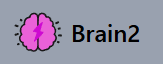

    

<h1 align="center">Brain2 - Your Second Brain</h1>

    <strong>Give your memory a break and let Brain2 hold the keys to your favorite content.</strong>

---

## Table of Contents

-   [Key Features](#key-features)
-   [Tech Stack](#tech-stack)
-   [Project Architecture](#project-architecture)
-   [Project Structure](#project-structure)
-   [Setup and Installation](#setup-and-installation)

---

## Key Features

- **Smart Link Capture:** Save any social media link in seconds — from Instagram posts to YouTube videos — add link and autofetch title, thumbnail
- **Organized Collections:** Group your saved links into custom collections and folders, making it effortless to find the right content at the right time.
- **Tag & Filter System:** Add custom tags to your links and filter your library by platform, tag, or date — so nothing ever gets lost in the noise.
- **Cross-Device Sync:** Your entire link library stays in sync across all your devices in real time — save on mobile, access on desktop.
- **One-Click Share:** Share any saved link or entire collection with others via a unique shareable URL.

---

## Tech Stack

This project is a full-stack typescript based MERN application.

| Category      | Technology                | Purpose                                            |
| ------------- | ------------------------- | -------------------------------------------------- |
| **Frontend**  | React, Vite, Tailwind CSS | For a fast, modern, and responsive user interface. |
| **Backend**   | Node.js, Express          | For the core server logic and API endpoints.       |
| **Database**  | MongoDB (with Mongoose)   | To save the content of the user for later use.     |
| **Validation** | **ZOD**                  | For various schema/input validations.              |

---
